# Lab 4: Industrial Robotics

This repository contains the modules in RAPID generated by RobotStudio. In these modules, you will find the code used to define different paths to draw the letters AEC with the robot ABB IRB140. For this reason, it was necessary to use a marker as the end effector and to design the marker holder.

## Authors

- Maria Alejandra Arias Frontanilla
- Camilo Andres Vera Ruiz
- Edwin Alfredo Higuera Bustos

(That's why AEC :) )

## Tool design

Camilo

## Tool calibration

Well, once we have designed the tool, we proceed to mount it on the robot and see that it fits correctly.


To carry out the calibration process of the built tool, it is first necessary to create an empty tooldata object located on the robot's flank, to which values ​​are assigned automatically, using a four-point and one-axis technique, which consists of performing four approaches with the tool to a point in space which is indicated by a guide like the one shown in the figure.


These approaches are made with different orientations, and at the end a last approach will be made from the z axis.

### Position 1


### Position 2


### Position 3


### Position 4


### z-axis


When computing the obtained values, a tooldata is returned that will allow us to manipulate the tool in an appropriate way.

## Creation of virtual tool in robotstudio

Ok, now for comparison purposes we import the CAD model of the tool into RobotStudio, for this we import our geometry as a .SAT file.


After verifying that the geometry will be imported correctly, we proceed to create the TCP coordinate base of the new tool, in this case the coordinate base is called Frame_1.

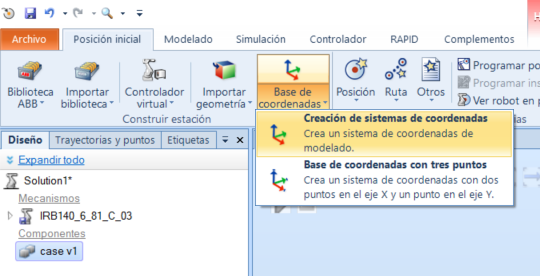

Frame_1 is then placed at the tip of the tool and constrained to be normal to the contact surface.

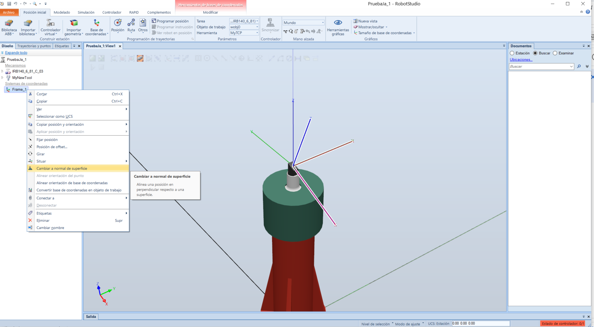

This point only remains for us to convert our mesh into a virtual tool that can be used from RobotStudio, for this we go to the modeling section, Create tool where the following dialog boxes will appear.

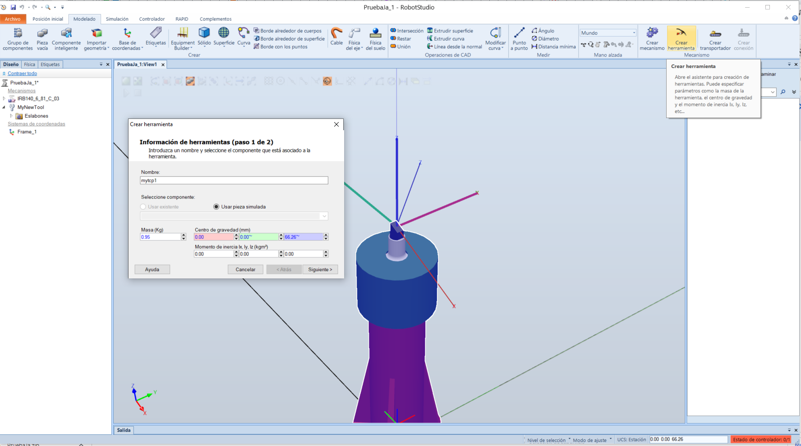

The first of the pop-up windows asks us for a name for the tool, its mass as well as the center of mass, fortunately for us RobotStudio provides the necessary resources to associate the latter automatically.

As for the mass of the tool, it was obtained by conventional means.

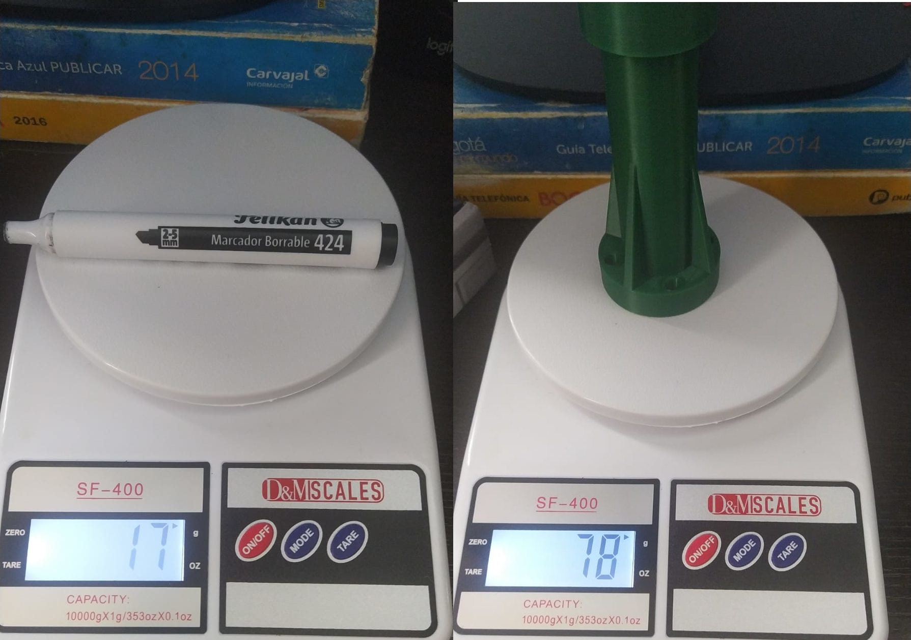

The second popup only asks us to assign a frame, at this point we clearly mark Frame_1

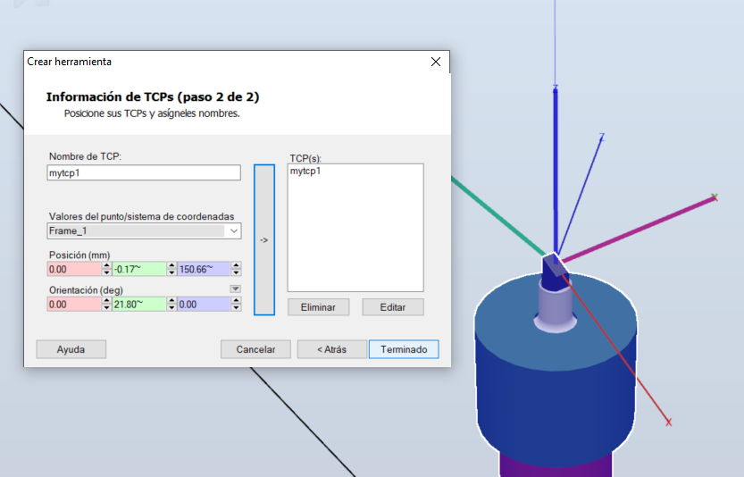

Now proceed to place the tool on the side of the robot, leaving it ready to start working.

Here you can see our assembled tool.

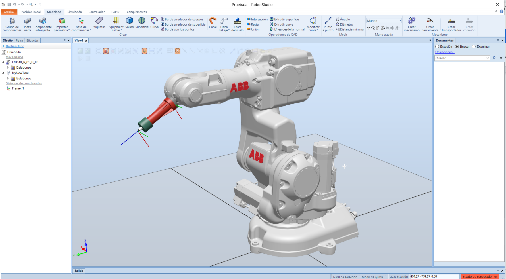

## Path generation in Robotstudio

Ok! We already have the tool in RobotStudio. Let's begin to create the necessary things to draw our AEC. What do we need? We need to create a Workobject.

### Creating a workobject

In order to use the same path, which will allow the robot to draw our AEC, with a different plane orientation or position, we need to create a workobject.

A workobject defines a different coordinate system. In our case, we will attach that workobject to a rectangular surface as shown in the image below.

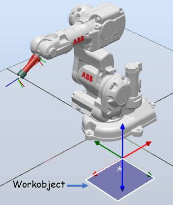

As you can see, the workobject creates a different coordinate system. If we move the surface, everything that is defined in that workobject will move as well. That's exactly the behaviour that we are looking for. If it seems a little bit confusing, don't worry. We will see it later with more detail.

### Creating the targets

Workobject ready. Now what? We need to create the targets that will belong to the path. Ok... Targets... Sure. What's that? Targets are points with a determined position and orientation that will reach the robot with its TCP. In our case, those targets will be defined in the workobject that we just created. Those targets will have a position in x and y of the workobject's coordinate system. The image below shows all the targets that we need and their respective names.

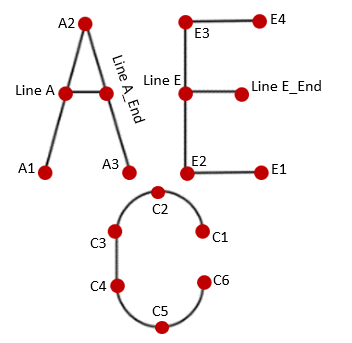

Those names can be found in the variables declaration in the source code. Here you can see how all those targets belong to the workobject called _Tablero_.

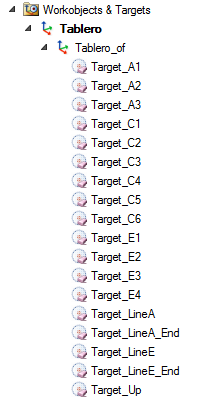

The last target is called Up. This one is used to lift the marker in order to begin another trace.

We created also another target called Home to set the pose of the robot in a beginning position.

### Creating the paths

Ok! We are getting closer. We have our targets and now we will create the paths. Paths allow us to indicate the way we want the TCP to go from one target to another one. In our case, we created four different paths: Path A, Path E and Path C to draw the letters A, E and C and the Path Lines to draw the lines of the letters A and E.

There are many ways how we can go from one target to another. In this lab, there were three main movements:

- **MoveJ**: With this movement the TCP goes from one target to another with a free movement of the joints. That means that it won't (most of the times) follow a line between targets.
- **MoveL**: With this movement the TCP goes from one target to another following a line.
- **MoveC**: With these movement the TCP goes from one target to another following an arc.

For the letter A we wanted a MoveJ to the target Home and from target Home to target Up. The other movements needed to be linear.

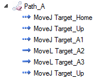

The same occurs with Path E, C and lines. All this can be found in both files .mod in RAPID. (Both files have the same paths since they are attached to a workobject).

### Setting other parameters

In order to move the TCP from one target to another, it was necessary to set the zone. This one is a parameter that allow us to determine how close we want the TCP to be of the target to consider that it has already achieved the desired position. In our case, that parameter was set to _fine_. With that value, we assured that the TCP reached exactly the target that we specified.

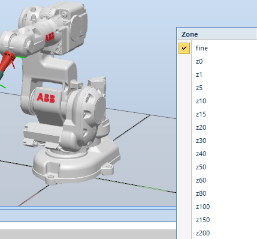

Other parameter that is really important is the speed of the movement. In our case, it was set to v400, that means, 400 mm/s.

### Synchronizing to RAPID

After having all the paths ready, we created a main routine that called all those paths. The main routine is the entry point and it is the one that will be executed by default in RAPID.

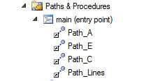

After doing this, we can synchronize everything that we created in the workspace of the robot in RAPID. This process is shown in the image below.

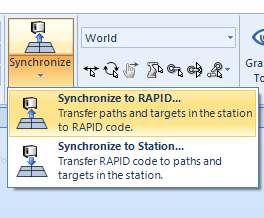

After doing this, we can check in the Module, which was automatically created, the main function with all the paths.

```RAPID
    PROC main()

        Path_A;
        Path_E;
        Path_C;
        Path_Lines;
    ENDPROC

```

### Simulations in Robotstudio

We can now check if everything works properly by simulating.

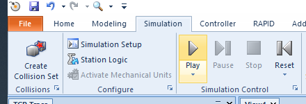

In the image below, it can be seen the TCP trace following all the paths that we created.

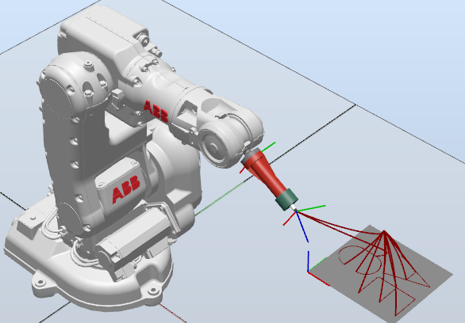

Ok. It works! Interesting. What if now we want to change the position and orientation the surface where our letters are written. Do we need to create all the targets and paths again? :O ... Tha answer is no. We don't have to :D. We just need to move or rotate the workobject the way we want to and synchornize again and that's it! That's the magic of the workobjects. Since all the targets are attached to the workobject, when moving the workobject, we also update the position of the targets and the paths.

In our case, we moved the workobject to the cuadrant +x, -y and changed the orientation of the surface 30 degrees. We synchornized and it worked. The result can be seen in the image below.

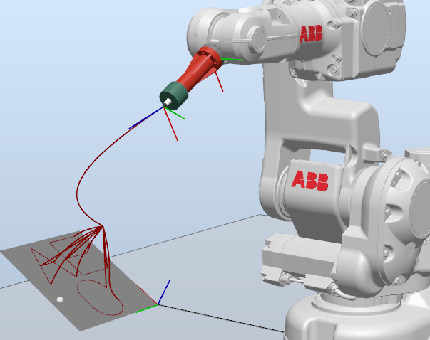

### Seeing it for real

Nowadays, tools like Robotstudio are great to check the possible behaviour of the routine. But! There's no comparison to see it for real. It's far more exciting and also complicated. In Robotstudio we had surfaces that were totally plane. That was definetely not the case in the actual laboratory. Anywar, after changing some height parameters and trying, we finally got it :D

You can see the robot drawing the letters in a horizontal plane in this video: [Horizontal plane drawing](https://www.youtube.com/watch?v=G0qVg6cYPoY).
And the one with a different position and orientation in this video: [Inclined plane drawing](https://www.youtube.com/watch?v=5Y6JozmU3L4).

## Conclusions

Setting up all the components to create the path for the TCP was a realtively easy task. After knowing how the software works, it was easy to check and try again if necessary with the help of simulations. However, real life tends to be quite different. It is really important to take into account all the obstacles that may appear in the way when checking the behaviour in a real environment. These kind of things occur not only in an academic space but also in the industry.
